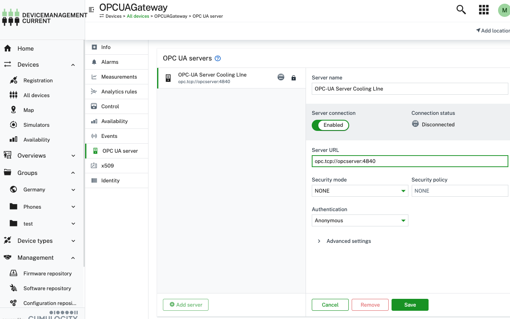
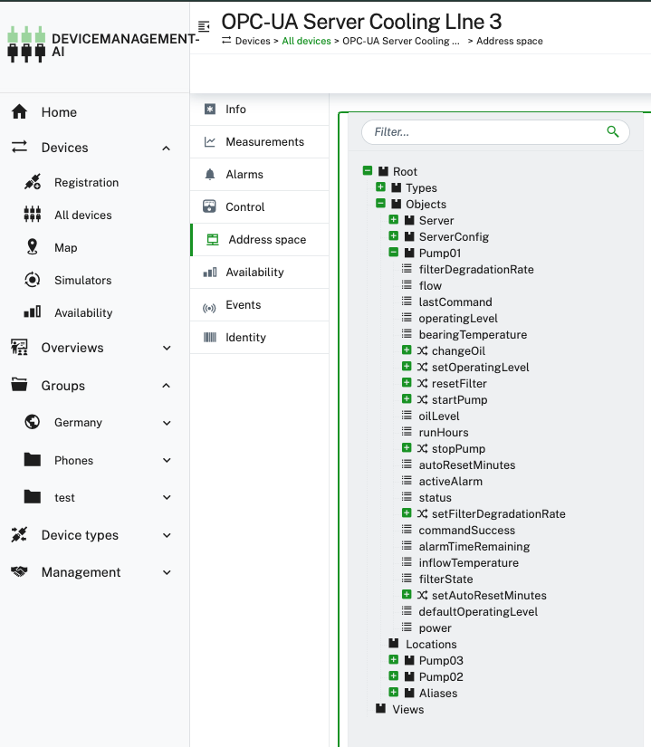

### OPC-UA Demo Solution
This demo showcases:

* How to deploy a thinEdge demo container and connect it to a cumulocity tenant.
* Deploy an demo opc-ua server via software management (container group docker-compose) which simulates a industrial pump
* Deploy the cumulocity opc-ua-device-gateway via software management
* Connect the gateway to the server
* Deloy a device portocol to ready metrics form the pump
* Deploy a dashboard to display pump metrics 

## Start ThinEdge Demo Container

* Install the cumulocity cli like documented [here](https://goc8ycli.netlify.app/docs/installation/)
* Add the tedgeExtension to the cli like documented [here](https://github.com/thin-edge/c8y-tedge)
* You need some kind of docker installation to run the demo container. Please install docker desktop or docker engines like colima or Rancher Desktop.
* Create a new session for the cli and provide necessary credentials etc.:
```bash
c8y session create <session-name>
````
* Activate the session (choose the session name you created beforehand):
```bash
set-session 
```
* Start the demo container and give it a name (e.g. ThinEdge-cooling-line3)::
```bash
c8y tedge demo start ThinEdge-cooling-line3
```
* This will start the container and automatically register the device in your tenant. You can check this in your tenant under "Devices". The device will be created as a "ThinEdge" device type and name ThinEdge-cooling-line3.
The demo container is running a docker host (podman) on its own. You can use it to deploy the opc-ua server and the gateway.
## Deploy the opc-ua server and opc-ua-device-gateway

* You have to deploy both docker-compose files to software management in your tenant. The type of the software to deploy must be container-group.
*  You can find both under [software](./software).
*  You can deploy the software using the web interface or c8y cli or like:
  

### Deploy the opc-ua-demo-server
```bash
c8y software create --name opc-ua-server --softwareType container-group --description "OPC-UA Demo Server to simulate an industrial pump" | c8y software versions create --version 0.0.1 --url https://raw.githubusercontent.com/thin-edge/opcua-solution-demo/refs/heads/main/software/docker-compose-opc-ua-demo-server.yml
```
Please keep in mind that this docker compose uses host.containers.internal which is supported by podman which is running inside the demo container. If you want to run this on a different docker host you might need to adjust the compose file. e.g. use host.docker.internal for docker desktop on windows or mac.

### Deploy the opc-ua-device-gateway
```bash
c8y software create --name opc-ua-device-gateway --softwareType container-group --description "Cumulocity OPC-UA Device Gateway" | c8y software versions create --version 0.0.1 --url https://raw.githubusercontent.com/thin-edge/opcua-solution-demo/refs/heads/main/software/docker-compose-opcua-device-gateway.yaml
```
* Now you can install both software packages on your device ThinEdge-cooling-line3 via software management in the web interface (great to demo) or like:
```bash
c8y software versions install --device ThinEdge-cooling-line3 --software opc-ua-server --version 0.0.1

c8y software versions install --device ThinEdge-cooling-line3 --software opc-ua-device-gateway --version 0.0.1  
```
* After a short while both containers should be running in the demo container. The now running opc-ua-device-gateway will automatically create a childDevice under ThinEdge-cooling-line3 with the name OPCUAGateway. .

### Connect the gateway to the opc-ua server
* Configure a new OPC UA Server in the OPCUAGateway child device using the web UI like:


* Server URL: opc.tcp://opcserver:4840  is the container name of the opc-ua-demo-server in the docker-compose file. Since both containers are running in the same podman instance inside the demo container they can reach each other via container name.
* Security Policy: None
* Security Mode: None

### Check OPC UA Server connection and namespace

* After saving the server configuration a new child device with the name OPC-UA Server Cooling Line 3 should appear under device OPCUAGateway
* To check if the connection to the server was successful you can check whether there is a new operation under control tab which says "[AUTO] Address space import from Root node"
* After the address scan is finised you should see an entry under Address Space. You can now browse the namespace of the opc-ua-demo-server.


### Create a device protocol to read pump metrics
* To read metrics from the opc-ua-demo-server we need to create a device protocol. You could create a protocol from scratch using the web UI under Device types -> Device protocols but for this demo we provide a preconfigured protocol which you can directly import.

* You can find the protocol file [here](./device-protocols/opc-ua-pump-device-protocol.json) it can be imported using the cli like:


