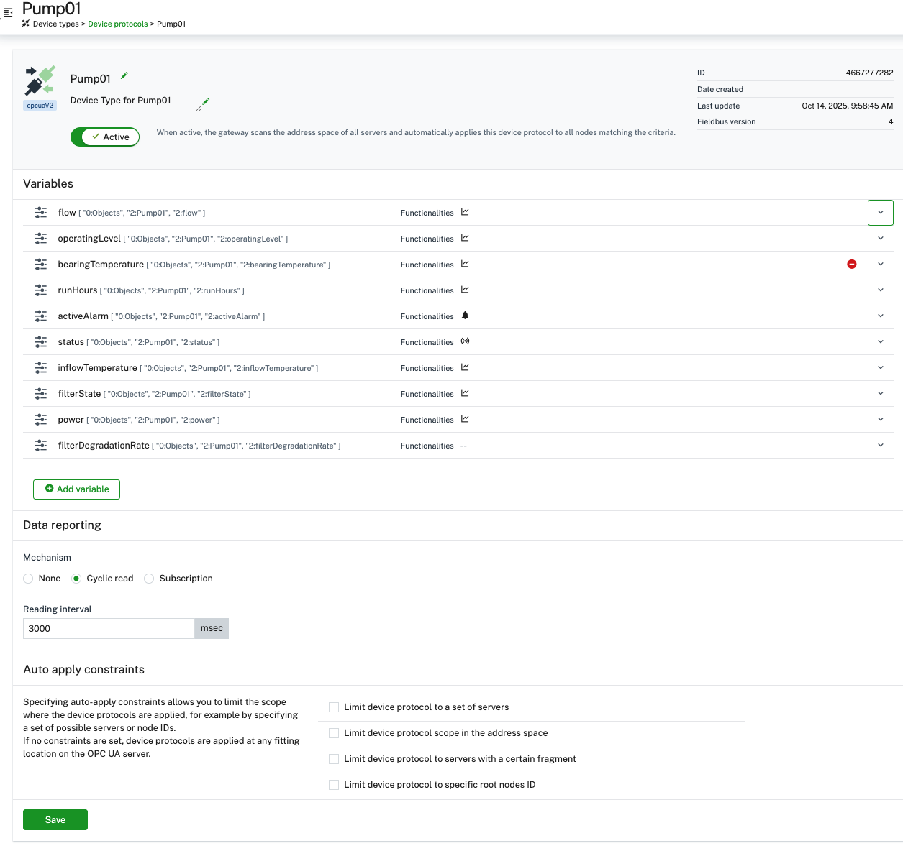
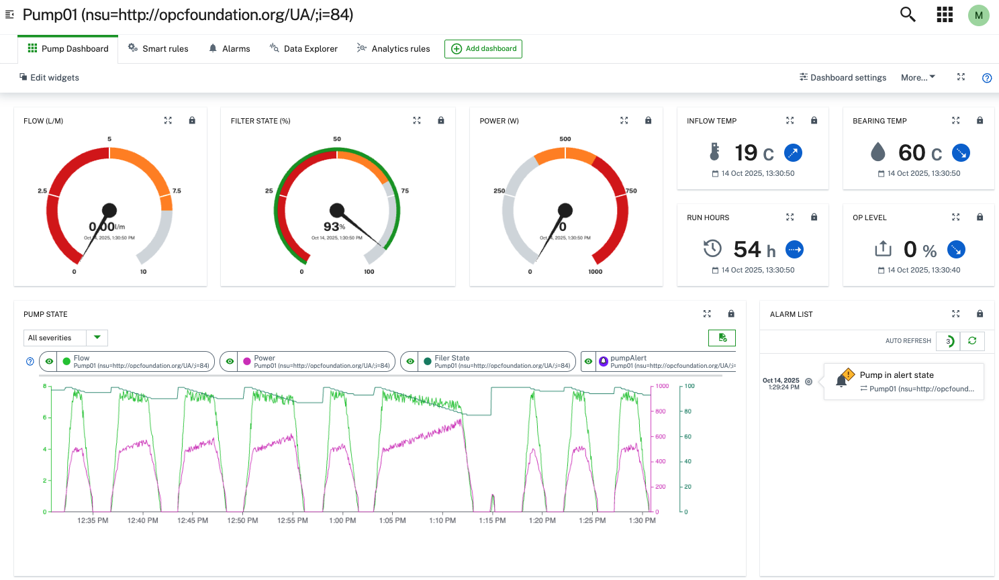
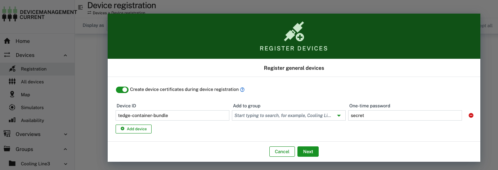

# OPC-UA Demo Solution
- [OPC-UA Demo Solution](#opc-ua-demo-solution)
  - [OPC-UA Solution using ThinEdge Demo Container](#opc-ua-solution-using-thinedge-demo-container)
    - [Start ThinEdge Demo Container](#start-thinedge-demo-container)
    - [Deploy the opcua-server and opcua-device-gateway](#deploy-the-opcua-server-and-opcua-device-gateway)
    - [Deploy the opcua-demo-server](#deploy-the-opcua-demo-server)
    - [Deploy the opcua-device-gateway](#deploy-the-opcua-device-gateway)
    - [Connect the gateway to the opc-ua server](#connect-the-gateway-to-the-opc-ua-server)
    - [Check OPC UA Server connection and namespace](#check-opc-ua-server-connection-and-namespace)
    - [Create a device protocol to read pump metrics](#create-a-device-protocol-to-read-pump-metrics)
    - [Deploy a dashboard to display pump metrics](#deploy-a-dashboard-to-display-pump-metrics)
  - [Production like deployment examples](#production-like-deployment-examples)
    - [ThinEdge Native on linux host with docker](#thinedge-native-on-linux-host-with-docker)
      - [Adjust thinEdge.io configuration to let containers access the mqtt broker](#adjust-thinedgeio-configuration-to-let-containers-access-the-mqtt-broker)
      - [Deploy the  opc-ua-device-gateway](#deploy-the--opc-ua-device-gateway)
    - [ThinEdge Container Bundle](#thinedge-container-bundle)
      - [Deploy the  opcua-device-gateway with the ThinEdge Container Bundle](#deploy-the--opcua-device-gateway-with-the-thinedge-container-bundle)


This repo should help you to quickly setup a demo to showcase a demo for Cumulocity using ThinEdge, the opcua-device-gateway and an OPC-UA server simulating an industrial pump. In addition it will showcase  examples of production like deployments of thinEdge and the opcua-device-gateway.

## OPC-UA Solution using ThinEdge Demo Container

The ThinEdge demo container is a great way to quickly setup a demo environment for Cumulocity. It comes with a pre-installed thin-edge.io installation and podman as docker host. This allows you to easily deploy the opcua-device-gateway and an opcua server simulating an industrial pump.

### Start ThinEdge Demo Container

* Install the cumulocity cli like documented [here](https://goc8ycli.netlify.app/docs/installation/)
* Add the tedgeExtension to the cli like documented [here](https://github.com/thin-edge/c8y-tedge)
* You need some kind of docker installation to run the demo container. Please install docker desktop or docker engines like colima or Rancher Desktop.
* Create a new session for the cli and provide necessary credentials etc.:
```bash
c8y session create <session-name>
````
* Activate the session (choose the session name you created beforehand):
```bash
set-session 
```
* Start the demo container and give it a name (e.g. ThinEdge-cooling-line3)::
```bash
c8y tedge demo start ThinEdge-cooling-line3
```
* This will start the container and automatically register the device in your tenant. You can check this in your tenant under "Devices". The device will be created as a "ThinEdge" device type and name ThinEdge-cooling-line3.
The demo container is running a docker host (podman) on its own. You can use it to deploy the opcua-server and the gateway.

### Deploy the opcua-server and opcua-device-gateway
* You have to deploy both docker-compose files to software management in your tenant. The type of the software to deploy must be container-group.
*  You can find both under [software](./software).
*  You can deploy the software using the web interface or c8y cli or like:
  

### Deploy the opcua-demo-server
```bash
c8y software create --name opcua-server \
--softwareType container-group \
--description "OPC-UA Demo Server to simulate an industrial pump" | \
c8y software versions create --version 0.0.1 \
--url https://raw.githubusercontent.com/thin-edge/opcua-solution-demo/refs/heads/main/software/docker-compose-opcua-demo-server.yml
```
Please keep in mind that this docker compose uses host.containers.internal which is supported by podman which is running inside the demo container. If you want to run this on a different docker host you might need to adjust the compose file. e.g. use host.docker.internal for docker desktop on windows or mac.

### Deploy the opcua-device-gateway
```bash
c8y software create \
--name opcua-device-gateway \
--softwareType container-group \
--description "Cumulocity OPC-UA Device Gateway" | \
c8y software versions create \
--version 0.0.1 \
--url https://raw.githubusercontent.com/thin-edge/opcua-solution-demo/refs/heads/main/software/docker-compose-opcua-device-gateway-container-bundle.yml
```
* Now you can install both software packages on your device ThinEdge-cooling-line3 via software management in the web interface (great to demo) or like:
```bash
c8y software versions install \
--device ThinEdge-cooling-line3 \
--software opcua-server \
--version 0.0.1

c8y software versions install \
--device ThinEdge-cooling-line3 \
--software opcua-device-gateway \
--version 0.0.1
```
* After a short while both containers should be running in the demo container. The now running opc-ua-device-gateway will automatically create a childDevice under `ThinEdge-cooling-line3` with the name `OPCUAGateway`.

### Connect the gateway to the opc-ua server
* Configure a new OPC UA Server in the OPCUAGateway child device using the web UI like:


* Name the server `OPC-UA Server Cooling Line 3`
* Server URL: `opc.tcp://opcserver:4840`  is the container name of the opc-ua-demo-server in the docker-compose file. Since both containers are running in the same podman instance inside the demo container they can reach each other via container name.
* Security Policy: `None`
* Security Mode: `None`

### Check OPC UA Server connection and namespace

* After saving the server configuration a new child device with the name `OPC-UA Server Cooling Line 3` should appear under device `OPCUAGateway`
* To check if the connection to the server was successful you can check whether there is a new operation under control tab which says `[AUTO] Address space import from Root node`
* After the address scan is finished (can take a few minutes) you should see an entry under Address Space. You can now browse the namespace of the opc-ua-demo-server.


### Create a device protocol to read pump metrics
* To read metrics from the opc-ua-demo-server we need to create a device protocol. You could create a protocol from scratch using the web UI under Device types -> Device protocols but for this demo we provide a pre-configured protocol which you can directly import.

* You can find the protocol file [here](./device-protocols/opcua-pump-device-protocol.json) it can also be imported using the cli like:

```bash
wget https://raw.githubusercontent.com/thin-edge/opcua-solution-demo/refs/heads/main/device-protocols/opcua-pump-device-protocol.json -O - | c8y inventory create --name "Pump01" --type c8y_OpcuaDeviceType --template input.value
```

* After importing the protocol a new device with the name Pump01 should appear in your inventory. It is automatically assigned to the OPCUAGateway device as a child device.
* After import the device protocol looks like this:

* You should now be able to see the pump measurements in the device management application under the Pump01.

### Deploy a dashboard to display pump metrics
* To visualize the pump metrics we provide a pre-configured dashboard. It can be imported using the UI by creating a new dashboard in Cockpit or using the cli like:
```bash
### Get the device id of the Pump01 device
deviceId=$(c8y inventory list \
--type c8y_OpcuaDevice \
--owner device_ThinEdge-cooling-line3 | \
jq -r .id)

### Import the dashboard and replace the placeholder ###DASHBOARD_DEVICE_ID### with the actual device id of Pump01

wget https://raw.githubusercontent.com/thin-edge/opcua-solution-demo/refs/heads/main/dashboard/dashboardPumpMO.json -O - |\
sed "s/###DASHBOARD_DEVICE_ID###/${deviceId}/g" | \
c8y inventory children create --id $deviceId --global --childType addition --template input.value
```

After importing open Cockpit Application assign the Pump device to a group, open the device. The dashboard you can find named "Pump Dashboard". It should look like this: 


## Production like deployment examples

### ThinEdge Native on linux host with docker
In production you will install thinEdge.io natively on a linux machine.
Install instructions can be found [here](https://thin-edge.github.io/thin-edge.io/install/).

In addition this machine will run docker host the opc-ua-device-gateway and opc-ua server containers.
Instructions how to setup  docker  can be found  [here](https://docs.docker.com/engine/install/).

#### Adjust thinEdge.io configuration to let containers access the mqtt broker
To allow the containers to access the native thinEdge mqtt broker we need to adjust the thinEdge configuration like described [here](https://thin-edge.github.io/thin-edge.io/operate/configuration/mosquitto-configuration/#mosquitto-bind-address).

* Execute the following commands on your thinEdge host:
```
tedge disconnect c8y
sudo tedge config set mqtt.bind.address 0.0.0.0
tedge connect c8y
```
  to bind the mqtt broker to all interfaces.

#### Deploy the  opc-ua-device-gateway

You can deploy the opcua-device-gateway container on the native docker host using the [docker-compose-opcua-device-gateway-tedge-native.yml](https://raw.githubusercontent.com/thin-edge/opcua-solution-demo/refs/heads/main/software/docker-compose-opcua-device-gateway-tedge-native.yml).

```bash
c8y software create \
--name opcua-device-gateway \
--softwareType container-group \
--description "Cumulocity OPC-UA Device Gateway" | \
c8y software versions create \
--version native \
--url https://raw.githubusercontent.com/thin-edge/opcua-solution-demo/refs/heads/main/software/docker-compose-opcua-device-gateway-tedge-native.yml
```

If you have already a software this command might fail. Then you just have to create a new version of the existing software. You can also upload the compose file via the web interface as a new version.

### ThinEdge Container Bundle

You can run thinEdge.io as a container using the ThinEdge Container Bundle. Instructions can be found [here](https://github.com/thin-edge/tedge-container-bundle).

On your docker host execute:
```bash
docker volume create device-certs
docker volume create tedge
```

If you have the cumulocity CA-Feature enabled you can create a ca certificate like described  [here](https://cumulocity.com/docs/device-certificate-authentication/certificate-authority/#creating-a-ca-certificate-via-the-ui).

After the ca certificate is created you can create a new device registration via the UI (Devices -> Registration -> General).

The Device ID has to match the DEVICE_ID in the docker-compose file below.
The one time password you enter must be exported as an environment variable like that (it will be picked up by the container).
```bash
export DEVICE_ONE_TIME_PASSWORD=<your-one-time-password>
```

Download the [docker-compose-tedge-container-bundle](https://raw.githubusercontent.com/thin-edge/opcua-solution-demo/refs/heads/main/software/docker-compose-tedge-container-bundle.yml) file from this repo and  place it on your docker host.

Adjust the environment variables in the compose file according to your setup (DEVICE_ID, TEDGE_C8Y_URL, ...) and execute:
```bash
docker compose -f docker-compose-container-bundle.yml up -d
``` 
#### Deploy the  opcua-device-gateway with the ThinEdge Container Bundle

Using the the opcua-device-gateway-container with the ThinEdge Container Bundle has one caveat. You must also configure the environment variable TEDGE_C8Y_URL in the docker-compose file to point to your Cumulocity tenant. Hence it cannot run as a generic container like the other examples. This will change in the next release of the opcua-device-gateway.

Find an example docker compose to run the opcua-device-gateway with the container-bundle in this repo under software [docker-compose-opcua-device-gateway-container-bundle.yml](https://raw.githubusercontent.com/thin-edge/opcua-solution-demo/refs/heads/main/software/docker-compose-opcua-device-gateway-container-bundle.yml)

You can deploy it via software management like in the examples above.


