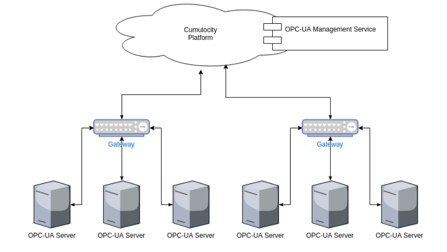
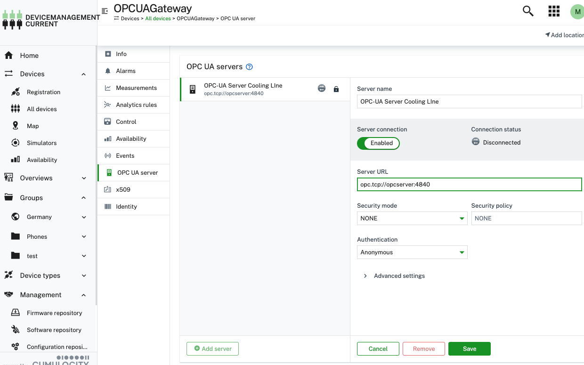
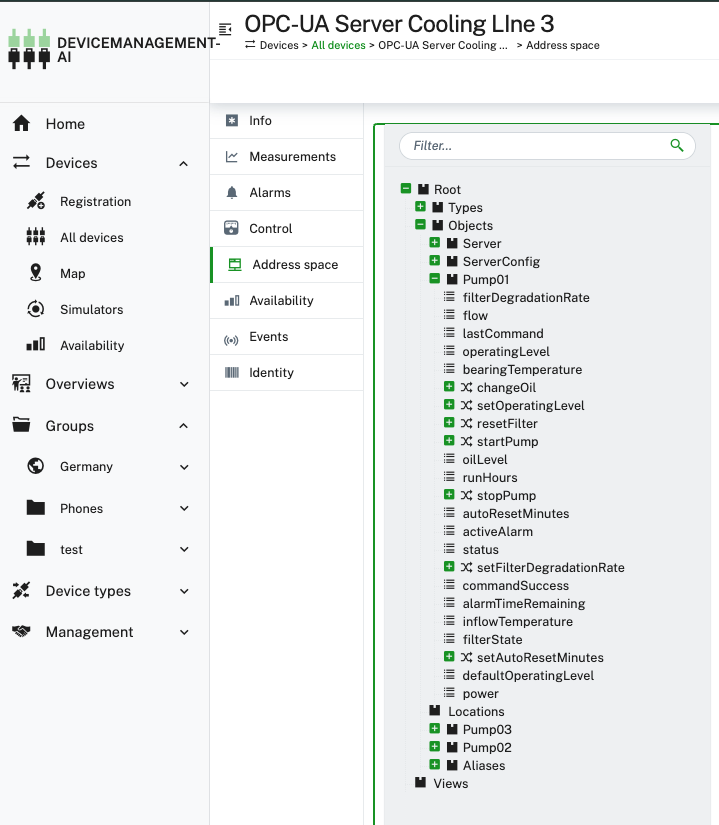
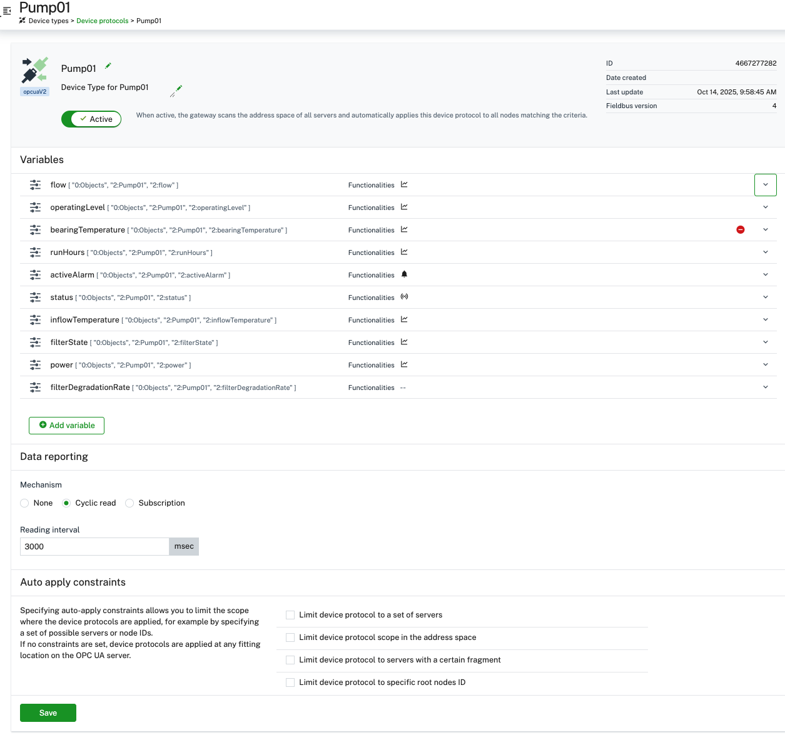
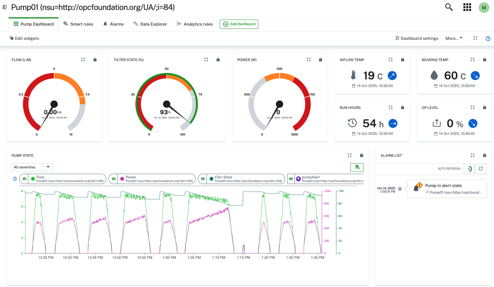
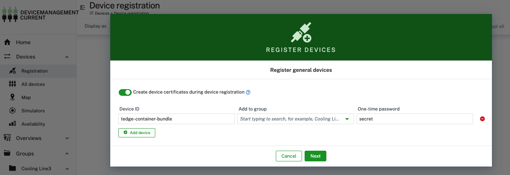

# OPC-UA Solution Blueprint

- [OPC-UA Solution Blueprint](#opc-ua-solution-blueprint)
  - [OPC-UA at a glance](#opc-ua-at-a-glance)
    - [Cumulocity's OPC-UA Device Gateway high level architecture](#cumulocitys-opc-ua-device-gateway-high-level-architecture)
    - [A word about address space and device protocols](#a-word-about-address-space-and-device-protocols)
  - [OPC-UA Demo using the ThinEdge Demo Container](#opc-ua-demo-using-the-thinedge-demo-container)
    - [Start ThinEdge Demo Container](#start-thinedge-demo-container)
    - [Deploy the opcua-server and opcua-device-gateway](#deploy-the-opcua-server-and-opcua-device-gateway)
    - [Deploy the opcua-demo-server](#deploy-the-opcua-demo-server)
    - [Deploy the opcua-device-gateway](#deploy-the-opcua-device-gateway)
    - [Connect the gateway to the opc-ua server](#connect-the-gateway-to-the-opc-ua-server)
    - [Check OPC UA Server connection and namespace](#check-opc-ua-server-connection-and-namespace)
    - [Create a device protocol to read pump metrics](#create-a-device-protocol-to-read-pump-metrics)
    - [Deploy a dashboard to display pump metrics](#deploy-a-dashboard-to-display-pump-metrics)
    - [Remove demo container](#remove-demo-container)
    - [Using the opcua-demo.sh script](#using-the-opcua-demosh-script)
  - [Production like deployment examples](#production-like-deployment-examples)
    - [ThinEdge Native on linux host with docker](#thinedge-native-on-linux-host-with-docker)
      - [Adjust thinEdge.io configuration to let containers access the mqtt broker](#adjust-thinedgeio-configuration-to-let-containers-access-the-mqtt-broker)
      - [Deploy the opc-ua-device-gateway](#deploy-the-opc-ua-device-gateway)
    - [ThinEdge Container Bundle](#thinedge-container-bundle)
      - [Deploy the opcua-device-gateway with the ThinEdge Container Bundle](#deploy-the-opcua-device-gateway-with-the-thinedge-container-bundle)
  - [Handling Device Protocols](#handling-device-protocols)
    - [Migrating Device Protocols](#migrating-device-protocols)

This repo should help you to quickly set up various deployment scenarios of the OPC-UA Device Gateway in combination with ThinEdge.io. It includes a demo simulating an industrial pump using ThinEdge, the OPC-UA Device Gateway, and an OPC-UA Simulation Server. In addition, it showcases examples of production-like deployments.

## OPC-UA at a glance

OPC-UA (Open Platform Communications Unified Architecture) is a machine-to-machine communication protocol for industrial automation developed by the OPC Foundation. It is designed to facilitate the exchange of data between devices and systems in industrial environments, regardless of the manufacturer or platform. OPC-UA provides a standardized way to represent and access data, making it easier for different devices and software applications to communicate with each other. It supports features such as data modeling, security, and scalability, making it a popular choice for industrial IoT applications.

Many industrial companies use OPC-UA to standardize the access to their machines and devices. You an connect multiple PLCs and other devices to a single OPC-UA server and create a unified interface that stays consistent over your machine park. It is crucial to consolidate and separate the field bus "World" from the IT world. Hence you can be sure that no third party access is disturbing the critical machine communication. Cumulocity's OPC-UA Device Gateway allows you to connect your OPC-UA enabled machines and devices to Cumulocity and leverage the benefits of a cloud-based IoT platform for monitoring, analytics, and integration with other systems.

### Cumulocity's OPC-UA Device Gateway high level architecture



### A word about address space and device protocols

When you configure the connection to an OPC-UA server using the OPC-UA Device Gateway it will automatically scan the address space of the server provide it in Cumulocity. You can browse the address space in Cumulocity,and choose which values you want to read and send to Cumulocity as measurements, events or alarms. This is done via device protocols which you can create in Cumulocity.
It is important to note that a device protocol (though you can limit it to one) is not tied to an OPC-UA server directly. Furthermore it defines a set of OPC-UA Browse paths which are evaluated against the address space of all configured OPC-UA servers.
Does a opc-ua device Gateway find a match for a browse path in the address space of one OPC-UA server, it will create a child device below that server. This means if you have the same variable in the same browse path in all your OPC-UA servers address spaces you only have to define that once and it will be automatically applied to all servers. This allows you to easily scale your OPC-UA integration to multiple machines without the need to create individual device protocols for each machine.
This even works even with just one opc-ua server, imagine a server with three pumps (like the simulation server we use in the demo) you can define one device protocol with the browse path to the pump "flow" variable but not from top level but just use the flow node. The gateway will automatically create three child devices for each pump and assign the pump speed variable to all three devices.

## OPC-UA Demo using the ThinEdge Demo Container

The ThinEdge demo container is a great way to quickly setup a demo environment for Cumulocity. It simulates a real linux device by spawning a systemd base container. It comes with pre-installed thin-edge.io installation and podman as docker host. This allows you to easily deploy the OPC-UA Device Gateway and an [OPC-UA Simulation Server](https://github.com/thin-edge/opc-ua-demo-server) simulating an industrial pump.

### Start ThinEdge Demo Container

Install the cumulocity cli like documented [here](https://goc8ycli.netlify.app/docs/installation/)

Add the tedgeExtension to the cli like documented [here](https://github.com/thin-edge/c8y-tedge)

You need some kind of docker installation to run the demo container. Please install docker desktop or docker engines like colima or Rancher Desktop.

Create a new session for the cli and provide necessary credentials etc.:

```bash
c8y session create <session-name>
```

- Activate the session (choose the session name you created beforehand):

```bash
set-session
```

- Start the demo container and give it a name (e.g. ThinEdge-cooling-line3):

```bash
c8y tedge demo start ThinEdge-cooling-line3 --features nopki
```

This will start the container and automatically register the device in your tenant. You can check this in your tenant under "Devices". The device will be created as a "ThinEdge" device type and name ThinEdge-cooling-line3.
The demo container is running a docker host (podman) on its own. You can use it to deploy the opcua-server and the gateway.

### Deploy the opcua-server and opcua-device-gateway

You have to deploy both docker-compose files to software management in your tenant. The type of the software to deploy must be container-group.

You can find both under [software](https://github.com/thin-edge/opcua-solution-blueprint/tree/main/software).

You can deploy the software using the web interface or c8y cli or like:

### Deploy the opcua-demo-server

```bash
c8y software create --name opcua-server \
--softwareType container-group \
--description "OPC-UA Demo Server to simulate an industrial pump" | \
c8y software versions create --version 0.0.1 \
--url https://raw.githubusercontent.com/thin-edge/opcua-solution-blueprint/refs/heads/main/software/docker-compose-opcua-demo-server.yml
```

Please keep in mind that this docker compose uses host.containers.internal which is supported by podman which is running inside the demo container. If you want to run this on a different docker host you might need to adjust the compose file. e.g. use host.docker.internal for docker desktop on windows or mac.

### Deploy the opcua-device-gateway

Only deploy if not already installed

```bash
c8y software create \
--name opcua-device-gateway \
--softwareType container-group \
--description "Cumulocity OPC-UA Device Gateway" | \
c8y software versions create \
--version demo-container \
--url https://raw.githubusercontent.com/thin-edge/opcua-solution-blueprint/refs/heads/main/software/docker-compose-opcua-device-gateway-demo-container.yml
```

Now you can install both software packages on your device ThinEdge-cooling-line3 via software management in the web interface (great to demo) or like:
Only deploy if not already installed

```bash
c8y software versions install \
--device ThinEdge-cooling-line3 \
--software opcua-server \
--version 0.0.1

c8y software versions install \
--device ThinEdge-cooling-line3 \
--software opcua-device-gateway \
--version demo-container
```

After a short while both containers should be running in the demo container. The now running opc-ua-device-gateway will automatically create a childDevice under `ThinEdge-cooling-line3` with the name `OPCUAGateway`.

### Connect the gateway to the opc-ua server

Configure a new OPC UA Server in the OPCUAGateway child device using the web UI like:



- Name the server `OPC-UA Server Cooling Line 3`
- Server URL: `opc.tcp://opcserver:4840` is the container name of the opc-ua-demo-server in the docker-compose file. Since both containers are running in the same podman instance inside the demo container they can reach each other via container name.
- Security Policy: `None`
- Security Mode: `None`

### Check OPC UA Server connection and namespace

After saving the server configuration a new child device with the name `OPC-UA Server Cooling Line 3` should appear under device `OPCUAGateway`

To check if the connection to the server was successful you can check whether there is a new operation under control tab which says `[AUTO] Address space import from Root node`

After the address scan is finished (can take a few minutes) you should see an entry under Address Space. You can now browse the namespace of the opc-ua-demo-server.


### Create a device protocol to read pump metrics

To read metrics from the opc-ua-demo-server we need to create a device protocol. You could create a protocol from scratch using the web UI under Device types -> Device protocols but for this demo we provide a pre-configured protocol which you can directly import.

You can find the protocol file [here](./device-protocols/opcua-pump-device-protocol.json) it can also be imported using the cli like:

```bash
wget https://raw.githubusercontent.com/thin-edge/opcua-solution-blueprint/refs/heads/main/device-protocols/opcua-pump-device-protocol.json -O - | c8y inventory create --name "Pump01" --type c8y_OpcuaDeviceType --template input.value
```

After importing the protocol a new device with the name Pump01 should appear in your inventory. It is automatically assigned to the OPCUAGateway device as a child device.

After import the device protocol looks like this:


- You should now be able to see the pump measurements in the device management application under the Pump01.

### Deploy a dashboard to display pump metrics

- To visualize the pump metrics we provide a pre-configured dashboard. It can be imported using the UI by creating a new dashboard in Cockpit or using the cli like:

```bash
### Get the device id of the Pump01 device
deviceId=$(c8y inventory list \
--type c8y_OpcuaDevice \
--owner device_ThinEdge-cooling-line3 | \
jq -r .id)

### Import the dashboard and replace the placeholder ###DASHBOARD_DEVICE_ID### with the actual device id of Pump01

wget https://raw.githubusercontent.com/thin-edge/opcua-solution-blueprint/refs/heads/main/dashboard/dashboardPumpMO.json -O - |\
sed "s/###DASHBOARD_DEVICE_ID###/${deviceId}/g" | \
c8y inventory children create --id $deviceId --global --childType addition --template input.value
```

After importing open Cockpit Application assign the Pump device to a group, open the device. The dashboard you can find named "Pump Dashboard". It should look like this:


### Remove demo container

To remove the demo container and all its artifacts use the `opcua-demo.sh` script (see below).

### Using the opcua-demo.sh script

The `opcua-demo.sh` script combines setup and teardown into a single file. It accepts a `start` or `stop` command followed by an optional device name (default: `ThinEdge-cooling-line3`).

Make sure you have an active `c8y` session (`set-session`) before running it.

**Start the demo**

Run locally:

```bash
sh opcua-demo.sh start MyDeviceName
```

Or directly from GitHub without cloning:

```bash
sh <(wget -q -O - https://raw.githubusercontent.com/thin-edge/opcua-solution-blueprint/refs/heads/main/opcua-demo.sh) start MyDeviceName
```

The script will:
1. Start the ThinEdge demo container and register the device in your tenant
2. Create and install the `opcua-server-<device-name>` and `opcua-device-gateway-<device-name>` software packages
3. Wait for the OPCUAGateway child device to appear and register the OPC-UA server managed object
4. Create the `Pump01-<device-name>` device protocol
5. Wait for the Pump OPC-UA device to be created and deploy the `Pump Dashboard - <device-name>` dashboard

**Stop and remove the demo**

Run locally:

```bash
sh opcua-demo.sh stop MyDeviceName
```

Or directly from GitHub:

```bash
sh <(wget -q -O - https://raw.githubusercontent.com/thin-edge/opcua-solution-blueprint/refs/heads/main/opcua-demo.sh) stop MyDeviceName
```

The script will:
1. Look up the root device → OPCUAGateway → OPC-UA server managed object (following the device hierarchy)
2. Delete the OPC-UA server via the `opcua-mgmt-service` REST API
3. Delete the `Pump01-<device-name>` device protocol
4. Delete the `opcua-server-<device-name>` and `opcua-device-gateway-<device-name>` software packages
5. Delete the demo container and unregister the device from the tenant

## Production like deployment examples

### ThinEdge Native on linux host with docker

In production you will install thinEdge.io natively on a linux machine.
Install instructions can be found [here](https://thin-edge.github.io/thin-edge.io/install/).

In addition this machine will run docker host the opc-ua-device-gateway and opc-ua server containers.
Instructions how to setup docker can be found [here](https://docs.docker.com/engine/install/).

#### Adjust thinEdge.io configuration to let containers access the mqtt broker

To allow the containers to access the native thinEdge mqtt broker we need to adjust the thinEdge configuration like described [here](https://thin-edge.github.io/thin-edge.io/operate/configuration/mosquitto-configuration/#mosquitto-bind-address).

- Execute the following commands on your thinEdge host:

```
sudo tedge disconnect c8y
sudo tedge config set mqtt.bind.address 0.0.0.0
sudo tedge connect c8y
```

to bind the mqtt broker to all interfaces.

#### Deploy the opc-ua-device-gateway

You can deploy the opcua-device-gateway container on the native docker host using the [docker-compose-opcua-device-gateway-tedge-native.yml](https://raw.githubusercontent.com/thin-edge/opcua-solution-blueprint/refs/heads/main/software/docker-compose-opcua-device-gateway-tedge-native.yml).

```bash
c8y software create \
--name opcua-device-gateway \
--softwareType container-group \
--description "Cumulocity OPC-UA Device Gateway" | \
c8y software versions create \
--version native \
--url https://raw.githubusercontent.com/thin-edge/opcua-solution-blueprint/refs/heads/main/software/docker-compose-opcua-device-gateway-tedge-native.yml
```

If you have already a software this command might fail. Then you just have to create a new version of the existing software. You can also upload the compose file via the web interface as a new version or use the cli to create a new version like:

```bash
c8y software get --id opcua-device-gateway | c8y software versions create --version native --url https://raw.githubusercontent.com/thin-edge/opcua-solution-blueprint/refs/heads/main/software/docker-compose-opcua-device-gateway-tedge-native.yml
```

### ThinEdge Container Bundle

You can run thinEdge.io as a container using the ThinEdge Container Bundle. Instructions can be found [here](https://github.com/thin-edge/tedge-container-bundle).

On your docker host execute:

```bash
docker volume create device-certs
docker volume create tedge
docker network create tedge
```

Please make sure you have no leftover data in the device-certs volume from previous thinEdge container bundle installations. If you have you can remove it via:

```bash
docker volume rm device-certs
docker volume create device-certs
```

If you have the cumulocity CA-Feature enabled you can create a ca certificate like described [here](https://cumulocity.com/docs/device-certificate-authentication/certificate-authority/#creating-a-ca-certificate-via-the-ui).

After the ca certificate is created you can create a new device registration via the UI (Devices -> Registration -> General).

The Device ID has to match the DEVICE_ID (tedge-container-bundle) in the docker-compose file below.
The one time password you enter must be exported as an environment variable like that (it will be picked up by the container).

```bash
export DEVICE_ONE_TIME_PASSWORD=<your-one-time-password>
```

Download the [docker-compose-tedge-container-bundle](https://raw.githubusercontent.com/thin-edge/opcua-solution-blueprint/refs/heads/main/software/docker-compose-tedge-container-bundle.yml) file from this repo and place it on your docker host.

```bash
wget https://raw.githubusercontent.com/thin-edge/opcua-solution-blueprint/refs/heads/main/software/docker-compose-tedge-container-bundle.yml
```

Adjust the environment variables in the compose file according to your setup (DEVICE_ID, TEDGE_C8Y_URL, ...) and execute:

```bash
docker compose -f ./docker-compose-tedge-container-bundle.yml up -d
```

#### Deploy the opcua-device-gateway with the ThinEdge Container Bundle

Using the the opcua-device-gateway-container with the ThinEdge Container Bundle has one caveat. You must also configure the environment variable TEDGE_C8Y_URL (<your-tenant>.cumulocity.com. !!! without https://) in the docker-compose file to point to your Cumulocity tenant. Hence it cannot run as a generic container like the other examples. This will change in the next release of the opcua-device-gateway.

Find an example docker compose to run the opcua-device-gateway with the container-bundle in this repo under software [docker-compose-opcua-device-gateway-container-bundle.yml](https://raw.githubusercontent.com/thin-edge/opcua-solution-blueprint/refs/heads/main/software/docker-compose-opcua-device-gateway-container-bundle.yml)

You can deploy it via software management like in the examples above but you need to make sure that the C8Y_BASEURL (https://<your-tenant>.cumulocity.com) environment variable is set correctly in the docker-compose file.

## Handling Device Protocols

Device Protocols configure which OPC-UA nodes should be read and transferred to a Cumulocity. You map values to measurements, events or alarms. How tocreate device protocols is described in the [OPC-UA Device Protocols](https://cumulocity.com/docs/device-integration/opcua/#device-protocols).

### Migrating Device Protocols

If you want to migrate device protocols from one tenant to another you can use the c8y cli to export and import them. Device Protocols are just managed objects in the inventory with type `c8y_OpcuaDeviceType`. You need to know the device id of the device protocol you want to export. You can find it in the url when opening the device protocol in the UI. Or you can list all device protocols using the cli like:

Set the export tenant where you want to extract the device protocols for the cli.

```bash
set-session export-tenant
```

List all device protocols:

```bash
c8y inventory list --type c8y_OpcuaDeviceType  | jq '{name: .com_cumulocity_opcua_common_model_mapping_DeviceType.name, id}'
```

Export the protocol and remove all not needed objects

```bash
c8y inventory get --id <device-protocol-id> --raw | jq '{com_cumulocity_opcua_common_model_mapping_DeviceType, type}' > device_protocol.json
```

Set the session to the import tenant

```bash
set-session import-tenant
```

Import the device protocol to the new tenant

```bash
c8y inventory create --data device_protocol.json
```
